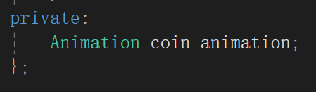

# cppGameTemplate
鉴于面向对象课程设计要写一个小游戏，我在网上随便抄了抄来写了一个框架，到时候方便写也方便ai生成，大部分的都只需要进行比较机械重复的工作就好了
## 本地调试

## 可视化库
在网上看教程用的是`easyx`，对于其中的一些功能想要查阅的话可以直接看[文档](https://docs.easyx.cn/zh-cn/loadimage)，需要安装的话直接执行文件夹中的`easyx`的可执行文件就安装好了，在使用的时候只需要`#include<graphics.h>`来导入头文件即可
## 开发流程
### 素材导入
把老师给的素材弄成一个个对应的图片，也就是俗称的精灵，[序列帧图片拆分教程](https://blog.csdn.net/fujiara/article/details/125259923)，然后在`main.cpp`中去声明这个全局变量

然后在`load_resources`中去加载资源

在对应的场景中利用图集去加载动画

下面的获取图集的代码

私有的动画对象

### 场景创建
在`scene`过滤器下面创建对应的场景头文件，然后创建场景类去实现方法（灰色的不要管，是ai的提示）

在`main.cpp`中去声明对应的场景变量，然后实例化

在场景管理器`sceneManager.h`中修改枚举类，修改`switch_scene`方法

接着按照自己的逻辑去修改场景的那几个`on_enter`,`on_update`,`on_draw`,`on_input`,`on_exit`方法基本上就完事了，ai写自己手写都很方便